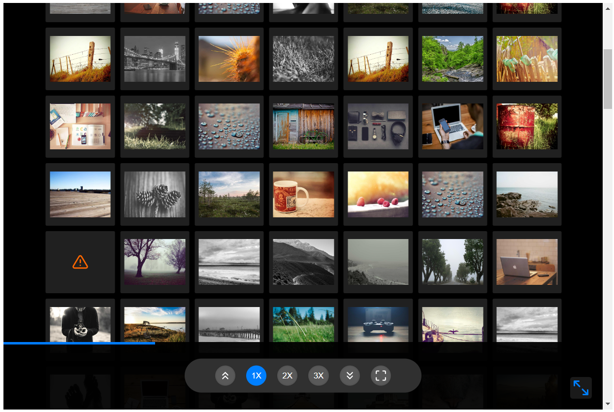

<p align="center">
  <a href="" rel="noopener">
 <!-- </a> -->
</p>

<h3 align="center">react-visual-grid</h3>

<div align="center">

[]()
[](/LICENSE)
[](https://codebeat.co/projects/github-com-prabhuignoto-react-visual-grid-main)
[](https://www.codefactor.io/repository/github/prabhuignoto/react-visual-grid)

</div>

---

<p align="center"> ⚡ The Powerful Visual grid / Gallery generator you always wanted
    <br> 
</p>

- [⚡ Features ](#-features-)
- [💭 How it works ](#-how-it-works-)
- [⚙️ Installation ](#️-installation-)
- [🍵 Usage ](#-usage-)
- [🍫 Props ](#-props-)
- [🍵 Example 1 (Horizontal) ](#-example-1-horizontal-)
- [🍵 Example 2 (Vertical) ](#-example-2-vertical-)
- [ImageProps](#imageprops)
- [ImageSizes](#imagesizes)
- [Theme](#theme)
- [⛏️ Built Using ](#️-built-using-)
- [✍️ Authors ](#️-authors-)

## ⚡ Features <a name = "about"></a>

- Generate image grids quickly and easily.
- Built-in virtualization for improved performance.
- Load thousands of images without worrying about performance.
- UI controls for adjusting image sizes.
- Render images horizontally or vertically in a grid.
- Resizable Grid
- Built with typescript.
- Easy-to-understand API and a completely configurable React component.

<!-- ## 🎥 Demo <a name = "demo"></a> -->



## 💭 How it works <a name = "working"></a>

`react-visual-grid` works with the absolute minimum of properties to determine the optimal method to render images. All that is required is to specify the picture sizes desired, and the component will automatically determine the optimum approach to render the images.

Because virtualization is built in, you won't have to worry about performance.

The component handles loading 5k+ photos with ease in the example. Both horizontal and vertical virtualization are supported.

## ⚙️ Installation <a name = "installation"></a>

You can install `react-visual-grid` using npm or yarn.

```bash
  npm install react-visual-grid
```

```bash
  yarn add react-visual-grid
```

## 🍵 Usage <a name = "usage"></a>

Grids can be generated in two modes: Horizontal and Vertical. The default mode is `vertical`

```js
import { Grid } from "react-visual-grid";

// generate random images using lorem picsum service
const images = Array.from({ length: 50 }, (_, i) => ({
  src: `https://picsum.photos/id/${Math.round(Math.random() * 110)}/800/600`,
  alt: `Image ${i + 1}`,
}));

const App = () => {
  return <Grid images={images} mode="auto" width={1800} height={1200} />;
};
```

## 🍫 Props <a name = "props"></a>

| Name            | Description                                                                               | Type                      | Default                   |
| :-------------- | :---------------------------------------------------------------------------------------- | :------------------------ | :------------------------ |
| enableResize    | Allows the grid to be freely resized                                                      | boolean                   | true                      |
| gap             | Gap in pixels between the images                                                          | number                    | 20                        |
| gridLayout      | Sets up the layout of the grid. can be `horizontal` or `vertical`                         | string                    | `vertical`                |
| height          | Height of the Grid                                                                        | number                    | 600                       |
| imageSizes      | Configures the zoom sizes of the Images                                                   | Object                    | [read more](#image-sizes) |
| images          | Collection of Images to be rendered                                                       | [ImageProps](#imageprops) | []                        |
| mode            | Configures the rendering mode. set mode to `manual` to render the columns / rows manually | string                    | `auto`                    |
| showProgressBar | Prop to show the progress bar                                                             | boolean                   | true                      |
| theme           | Prop to apply different color scheme for the component                                    | Object                    | [read more](#theme)       |
| width           | Width of the Grid                                                                         | number                    | 1200                      |

## 🍵 Example 1 (Horizontal) <a name = "horizontal"></a>

```js
import { Grid } from "react-visual-grid";

const App = () => {
  return (
    <Grid
      images={images}
      gridLayout="horizontal"
      width={1800}
      height={1200}
    />
  );
};
```

[CodeSandbox Playground](https://codesandbox.io/s/react-visual-grid-vertical-bn7yrf?file=/src/App.tsx)

## 🍵 Example 2 (Vertical) <a name = "vertical"></a>

```js
import { Grid } from "react-visual-grid";

const App = () => {
  return (
    <Grid images={images} gridLayout="vertical" width={1800} height={1200} />
  );
};
```

[CodeSandbox Playground](https://codesandbox.io/s/react-visual-grid-vertical-bn7yrf?file=/src/App.tsx)

## ImageProps

| Name    | Description                      | Type     | Default |
| :------ | :------------------------------- | :------- | :------ |
| src     | URL of the image                 | string   |         |
| alt     | Alt text for the image           | string   |         |
| width   | Width of the image               | number   | 100     |
| height  | Height of the image              | number   | 100     |
| id      | Unique of the image              | string   |         |
| onClick | callback to be executed on click | Function |         |

## ImageSizes

`react-visual-grid` currently supports 3 zoom levels for the images. The default zoom level is 2x. The zoom levels can be configured using the `imageSizes` prop.

The component comes with a default configuration for the image sizes. The default configuration is as follows:

```js
export const defaultImageSizes = {
  "1X": {
    width: 120,
    height: 100,
  },
  "2X": {
    width: 200,
    height: 180,
  },
  "3X": {
    width: 320,
    height: 280,
  },
};
```

you should be able to easily customize the desired dimensions for each zoom level.

## Theme

Customize the colors of the component with the `theme` prop.

Here is the list of all the colors that can be customized:

| Name                  | Description                           | Type   | Default             |
| :-------------------- | :------------------------------------ | :----- | :------------------ |
| backgroundColor       | Background color of the gallery       | string | #000                |
| controlBgColor        | Background color of the control strip | string | #303030             |
| controlBtnColor       | Button color of the controls          | string | #595959             |
| controlsBackDropColor | Backdrop color of the controls        | string | rgba(0, 0, 0, 0.95) |
| thumbnailBgColor      | Background color of the Thumbnails    | string | #202020             |

```jsx
<Grid
  gridLayout="vertical"
  theme={{
    backgroundColor: "#000",
    controlBgColor: "#303030",
    controlBtnColor: "#595959",
    controlsBackDropColor: "rgba(0, 0, 0, 0.95)",
    thumbnailBgColor: "#202020",
  }}
/>
```

[Custom Theme](https://codesandbox.io/s/react-visual-grid-vertical-theme-9vc6y3?file=/src/App.tsx)

## ⛏️ Built Using <a name = "built_using"></a>

- [typescript](https://www.typescriptlang.org/)
- [react](https://reactjs.org/)
- [classNames](https://jedwatson.github.io/classnames/)
- [nanoid](https://github.com/ai/nanoid)

## ✍️ Authors <a name = "authors"></a>

- [@prabhuignoto](https://github.com/prabhuignoto) - Idea & Initial work
