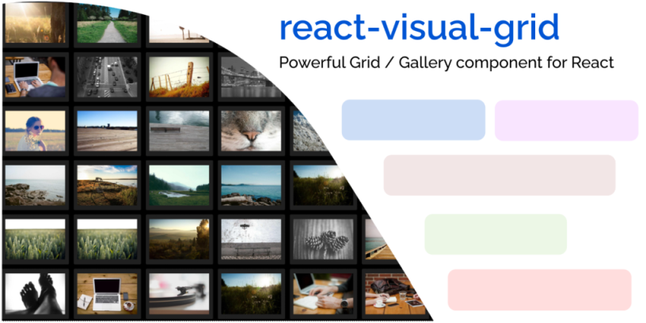

<p align="center">
  <a href="" rel="noopener">
</p>

<br />

<div align="center">
  </a>
</div>

<br />

<!-- <h3 align="center">react-visual-grid</h3> -->

<div align="center">

[]()
[](/LICENSE)
[](https://codebeat.co/projects/github-com-prabhuignoto-react-visual-grid-main)
[](https://www.codefactor.io/repository/github/prabhuignoto/react-visual-grid)


</div>

<p align="center" style="font-size: 2rem;color: #007fff">
  ⚡ Powerful Image Grid for React </br>
</p>
<p align="center" style="background: #f5f5f5;padding: 1rem;font-weight:bold;font-size:1.25rem">
  ⚡In built Virtualization | 🧱 Masonry Layout | 💪 Built with Typescript | 🚀 Customizable | 📦 7.5kb gzipped
</p>

- [⚡ Features ](#-features-)
- [💭 How it works ](#-how-it-works-)
- [⚙️ Installation ](#️-installation-)
- [🧋 Usage ](#-usage-)
- [🍫 Props ](#-props-)
- [🍭 Demo 1 (Horizontal) ](#-demo-1-horizontal-)
- [🍭 Demo 2 (Vertical) ](#-demo-2-vertical-)
- [ImageProps](#imageprops)
- [ImageSizes](#imagesizes)
- [Theme](#theme)
- [🧱 Masonry](#-masonry)
- [🍫 Masonry Props](#-masonry-props)
- [⛏️ Built Using ](#️-built-using-)
- [✍️ Authors ](#️-authors-)
- [🤝Contributing](#contributing)
- [Meta](#meta)

## ⚡ Features <a name = "about"></a>

- 🪟 Generate grids easily.
- 🧱 Build beautiful [Masonry](#-masonry) grids using the Masonry component
- ➡️ Render images horizontally or vertically in a grid.
- ⚡ Built-in virtualization for improved performance.
- 🖼️ Load thousands of images without worrying about performance.
- 🎛️ UI controls for adjusting image sizes.
- 💡 Resizable Grid
- 📦 Lightweight (7kb gzipped)
- 💪 Built with typescript.
- 💡 Intuitive API.

<br />


<br />

## 💭 How it works <a name = "working"></a>

`react-visual-grid` works with the absolute minimum of properties to determine the optimal method to render images. Specify the desired picture sizes and the layout, the component will automatically determine the optimum approach to rendering the images.

Comes with two different layouts (horizontal and vertical) for rendering images. The in-built virtualization ensures that the component renders only the images that are visible on the screen. This ensures that the component is able to render thousands of images without any performance issues.

Resize the grid or go full screen, and the component will automatically adjust the ideal number of images to be displayed in the new grid size.

## ⚙️ Installation <a name = "installation"></a>

You can install `react-visual-grid` using npm or yarn.

```bash
  npm install react-visual-grid
```

or

```bash
  yarn add react-visual-grid
```

## 🧋 Usage <a name = "usage"></a>

Grids can be generated in two modes: Horizontal and Vertical. The default mode is `vertical`

```js
import { Grid } from "react-visual-grid";

// generate random images using lorem picsum service
const images = Array.from({ length: 50 }, (_, i) => ({
  src: `https://picsum.photos/id/${Math.round(Math.random() * 110)}/800/600`,
  alt: `Image ${i + 1}`,
}));

const App = () => {
  return <Grid images={images} width={1800} height={1200} />;
};
```

The dimensions of the grid can be also specified as percentages.

```js
import { Grid } from "react-visual-grid";

const App = () => {
  return <Grid images={images} width="90%" height="80%" />;
};
```

## 🍫 Props <a name = "props"></a>

| Name            | Description                                                               | Type                      | Default                   |
| :-------------- | :------------------------------------------------------------------------ | :------------------------ | :------------------------ |
| enableResize    | Allows the grid to be freely resized                                      | boolean                   | true                      |
| enableDarkMode  | Displays a toggle switch for switching between dark mode and default mode | boolean                   | false                     |
| gap             | Gap in pixels between the images                                          | number                    | 20                        |
| gridLayout      | Sets up the layout of the grid. can be `horizontal` or `vertical`         | string                    | `vertical`                |
| height          | Height of the Grid                                                        | number or string          | 600                       |
| imageSizes      | Configures the zoom sizes of the Images                                   | Object                    | [read more](#image-sizes) |
| images          | Collection of Images to be rendered                                       | [ImageProps](#imageprops) | []                        |
| mode            | Configures the rendering mode. can be `auto` or `manual`                  | string                    | `auto`                    |
| showProgressBar | Prop to show the progress bar                                             | boolean                   | true                      |
| theme           | Prop to apply different color scheme for the component                    | Object                    | [read more](#theme)       |
| width           | Width of the Grid                                                         | number or string          | 1200                      |

## 🍭 Demo 1 (Horizontal) <a name = "horizontal"></a>

```js
import { Grid } from "react-visual-grid";

const App = () => {
  return (
    <Grid images={images} gridLayout="horizontal" width={1800} height={1200} />
  );
};
```

[Horizontal Grid rendering 1k+ images](https://codesandbox.io/s/react-visual-grid-horizontal-e217ix)

## 🍭 Demo 2 (Vertical) <a name = "vertical"></a>

```js
import { Grid } from "react-visual-grid";

const App = () => {
  return (
    <Grid images={images} gridLayout="vertical" width={1800} height={1200} />
  );
};
```

[Vertical Grid rendering 1k+ images](https://codesandbox.io/s/react-visual-grid-vertical-bn7yrf?file=/src/App.tsx)

## ImageProps

| Name    | Description                      | Type     | Default |
| :------ | :------------------------------- | :------- | :------ |
| src     | URL of the image                 | string   |         |
| alt     | Alt text for the image           | string   |         |
| width   | Width of the image               | number   | 100     |
| height  | Height of the image              | number   | 100     |
| id      | Unique of the image              | string   |         |
| onClick | callback to be executed on click | Function |         |

## ImageSizes

`react-visual-grid` currently supports 3 zoom levels and the default level is 2x. The zoom levels can be configured using the `imageSizes` prop.

The component comes with a default configuration for the image sizes.

```js
export const defaultImageSizes = {
  "1X": {
    width: 120,
    height: 100,
  },
  "2X": {
    width: 200,
    height: 180,
  },
  "3X": {
    width: 320,
    height: 280,
  },
};
```

you should be able to easily customize the desired dimensions for each zoom level.

## Theme

Customize the colors of the component with the `theme` prop.

Here is the list of all the colors that can be customized:

| Name                  | Description                           | Type   | Default             |
| :-------------------- | :------------------------------------ | :----- | :------------------ |
| primaryColor          | Primary color of the gallery          | string | #007fff             |
| backgroundColor       | Background color of the gallery       | string | #000                |
| controlBgColor        | Background color of the control strip | string | #303030             |
| controlBtnColor       | Button color of the controls          | string | #595959             |
| controlsBackDropColor | Backdrop color of the controls        | string | rgba(0, 0, 0, 0.95) |
| thumbnailBgColor      | Background color of the Thumbnails    | string | #202020             |

```jsx
<Grid
  gridLayout="vertical"
  theme={{
    backgroundColor: "#000",
    controlBgColor: "#303030",
    controlBtnColor: "#595959",
    controlsBackDropColor: "rgba(0, 0, 0, 0.95)",
    thumbnailBgColor: "#202020",
  }}
/>
```

[Custom Theme](https://codesandbox.io/s/react-visual-grid-vertical-theme-9vc6y3?file=/src/App.tsx)

## 🧱 Masonry

The masonry layout is a great choice for displaying images of different sizes. You can choose to fill the images horizontally or vertically, and choose how big you want them to be. The `Masonry` component sets the height and width of each image using class names. Class names should be formatted `rc-w-[width]`, where [width] corresponds to an integer length value measured in pixels; similarly, class names should be formatted `rc-h-[height]`, with correspondingly formatted values.

The layout honors the dimensions of the parent container, and the images will be automatically wrapped to the next row or column depending on the `fill` mode. In vertical fill mode, the images are arranged in columns, and in horizontal fill mode, the images are arranged in rows.

The `Masonry` Component exports as its own React Component, with documentation available at the following URL


```jsx
<Masonry fillMode="HORIZONTAL" height={1200} width={300}>
  <span className={`rc-w-100 rc-h-100`}>
    
  </span>
  <span className={`rc-w-200 rc-h-100`}>
    
  </span>
  <span className={`rc-w-200 rc-h-100`}>
    
  </span>
  <span className={`rc-w-100 rc-h-100`}>
    
  </span>
  <span className={`rc-w-300 rc-h-150`}>
    
  </span>
</Masonry>
```


## 🍫 Masonry Props

| Name     | Description                                                                        | Type   | Default |
| :------- | :--------------------------------------------------------------------------------- | :----- | :------ |
| height   | height of the grid                                                                 | Number | 1200    |
| width    | width of the grid                                                                  | Number | 800     |
| gutter   | spacing between the images                                                         | Number | 4       |
| fillMode | prop that controls the filling direction. can be either `HORIZONTAL` or `VERTICAL` | String | 4       |


## ⛏️ Built Using <a name = "built_using"></a>

- [typescript](https://www.typescriptlang.org/)
- [react](https://reactjs.org/)
- [classNames](https://jedwatson.github.io/classnames/)
- [nanoid](https://github.com/ai/nanoid)

## ✍️ Authors <a name = "authors"></a>

- [@prabhuignoto](https://github.com/prabhuignoto) - Idea & Initial work

## 🤝Contributing

1. [Fork it](https://github.com/prabhuignoto/react-chrono/fork)
2. Create your feature branch (`git checkout -b new-feature`)
3. Commit your changes (`git commit -am 'Add feature'`)
4. Push to the branch (`git push origin new-feature`)
5. Create a new Pull Request

## Meta

Distributed under the MIT license. See `LICENSE` for more information.

Prabhu Murthy – [@prabhumurthy2](https://twitter.com/prabhumurthy2) – prabhu.m.murthy@gmail.com
[https://github.com/prabhuignoto](https://github.com/prabhuignoto)
